# Subflows Sample

This sample is modeled on sample BookStore application and invoke a REST API  at the backend that delivers sample JSON data. This backend REST API is hosted at - hosted at https://my-json-server.typicode.com/tibcosoftware/tci-flogo/Book

First you will need to upload Throw Error Extention from [github.com/TIBCOSoftware/flogo-contrib/activity/error](https://github.com/TIBCOSoftware/flogo-contrib/tree/master/activity/error)

If you run any of these samples locally using TIBCO Flogo® Enterprise -

1. To Get all Books - You will need to hit the url - http://localhost:9999/books/ 
2. To Get Book By ISBN - you will need to hit the url - http://localhost:9999/books/1451648537
3. If you want to test Error Handler, you can hit the above url with Invalid ISBN number like http://localhost:9999/books/999
4. You can check the sample JSON data for correct ISBN to be used while testing the samples - https://my-json-server.typicode.com/tibcosoftware/tci-flogo/Book

## Import a sample

1. Download the sample’s .flogo file.

2. Create a new empty app.
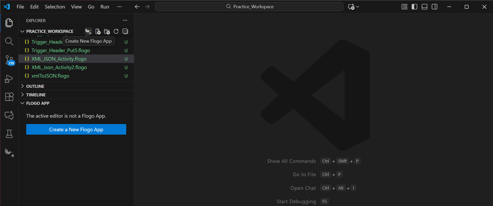

3. On the app details page, select Import app.
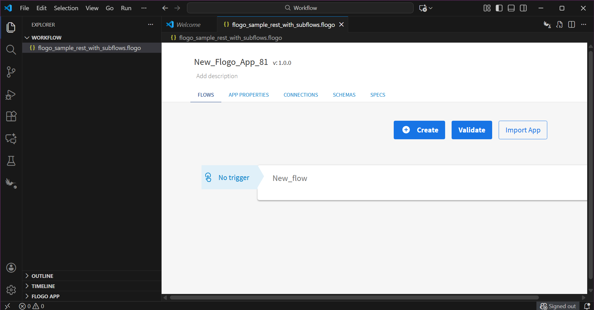

4. Browse on your machine or drag and drop the .flogo file for the app that you want to import.
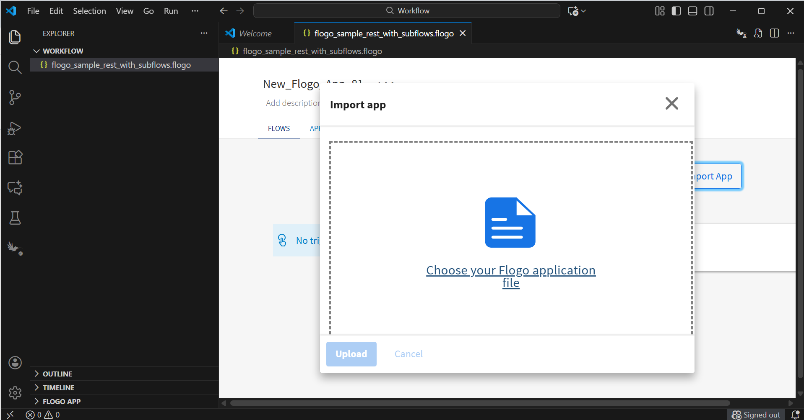

5. Click Upload. The Import app dialog displays some generic errors and warnings as well as any specific errors or warnings pertaining to the app you are importing. It validates whether all the activities and triggers used in the app are available in the Extensions tab.
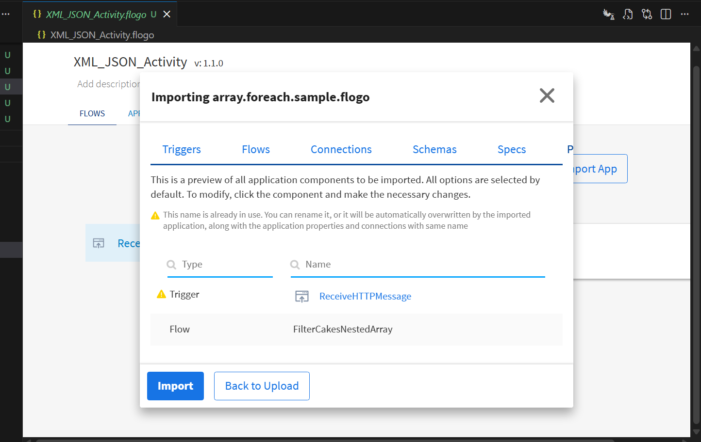

6. You can import all flows from the source app that are selected.
For the New_Flogo_App_81 application, the flows available for import are:
getBooks
getBookByISBN
SubFlowLogging
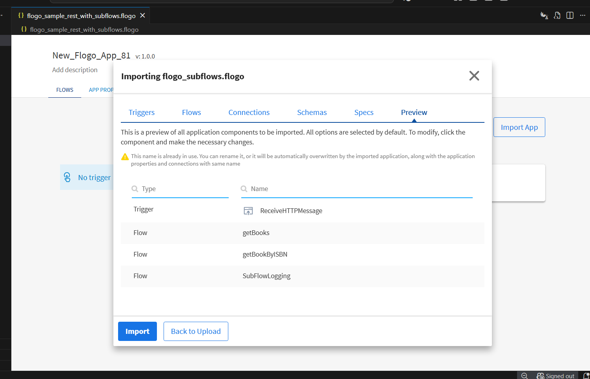

7. Click on the trigger. If you had not selected a trigger in the dialog, click Next. The flows associated with that trigger are displayed in the flow dialog. You have the option to select one or more of these flows such that the flows get imported as blank flows that are not attached to any trigger. By default, all flows are selected. Clear the check box for the flows that you do not want to import. If your flow(s) have subflows, and you select only the main flow but do not select the subflow, the main flow gets imported without the subflow.
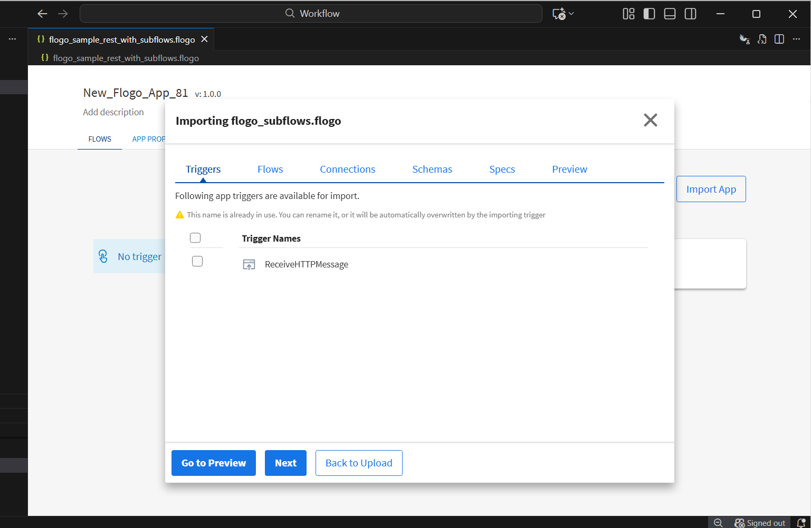

8. If you selected a trigger in the dialog, click Next. The flow associated with that trigger is selected and displayed in the flow dialog. You can’t able to deselect flows associated with the trigger. Other flows that have triggers not attached are also displayed here, and you have the option to select one or more flows such that the flows get imported as blank flows that are not attached to any trigger. By default, all flows are selected. Clear the check box for the flows that you do not want to import. If your flow(s) have subflows, and you select only the main flow but do not select the subflow, the main flow gets imported without the subflow. Click Import.

9. Subflow configuration. On opening the StartASubFlow activity, in the Settings tab, you can see the list of available subflows, the Open Subflow button, and an option to set detached invocation to true/false.
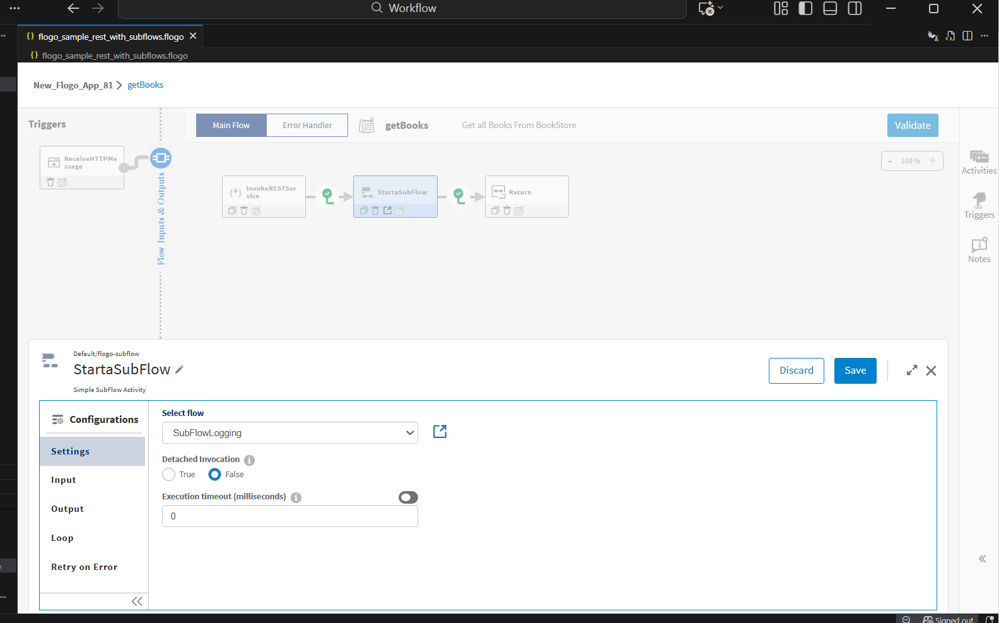

10. Opening a subflow. After selecting a subflow and saving it, clicking on the Open Subflow button appends the selected subflow to the right of the current flow.
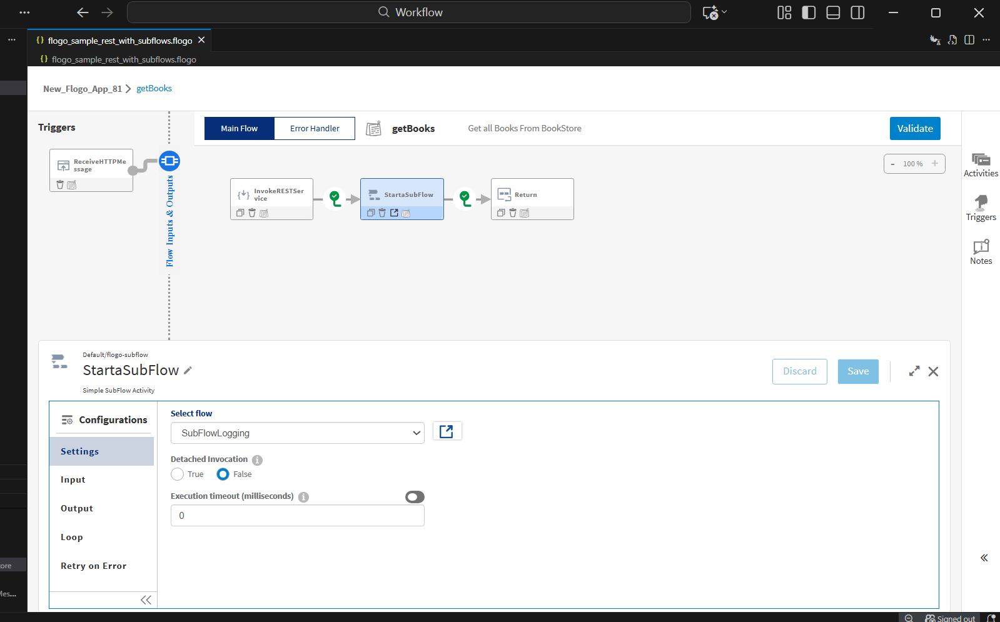
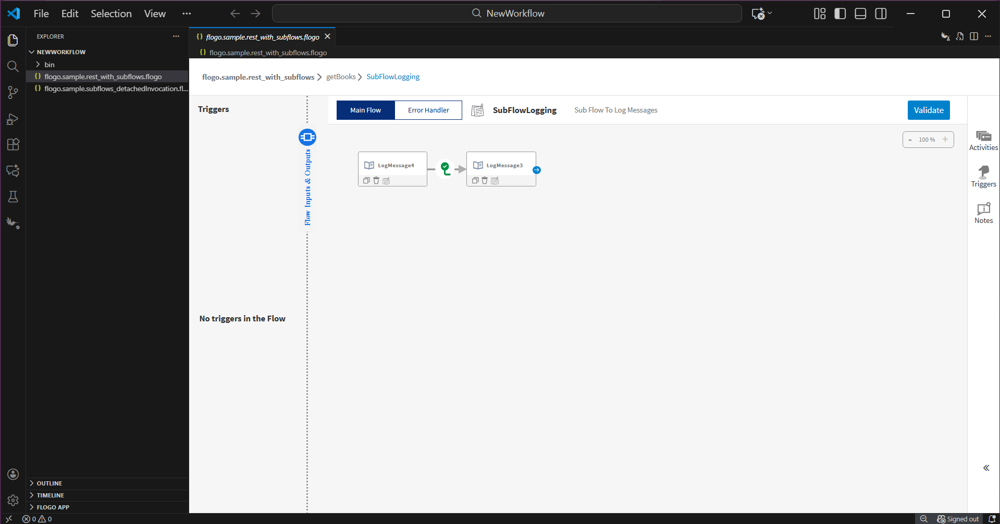

11. Set Detached Invocation. Refer to app JSON "flogo.sample.subflows_detachedInvocation".
Setting detached invocation to True, the subflow is invoked in fire-and-forget mode; in such a case, the main flow will not wait for the subflow to complete. Since the main flow is independent of the subflow output, the Output tab is hidden upon setting detached invocation. Detached invocation is set to False by default.
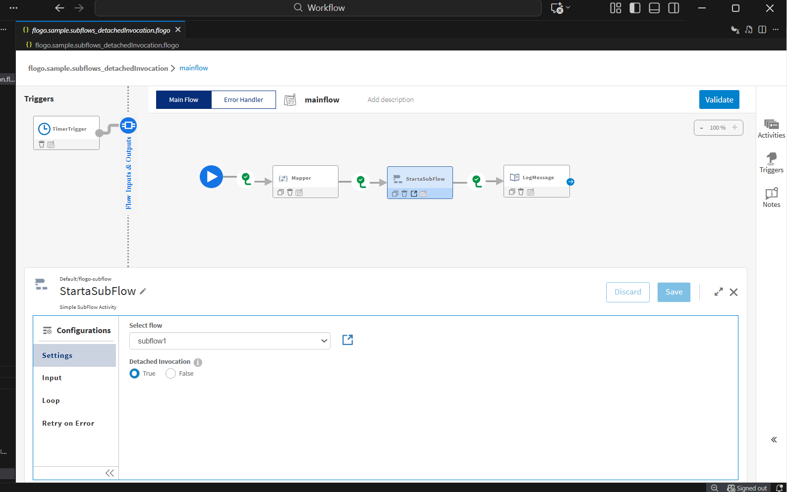

In this case, subflow1 is invoked in detached invocation True mode from the main flow. So, the main flow will not wait for completion of subflow1 and will execute the activities ahead. Since subflow1 is invoked in detached True mode, we will have 'Starting SubFlow 'res://flow:subflow1' in detached mode' printed in logs.

Upon encountering subflow1 in detached mode, the execution moves to completion of the main flow, and 'main flow execution' is printed followed by 'subflow2 execution' and 'subflow1 execution'.
The same can be understood by the timestamp difference in logs.
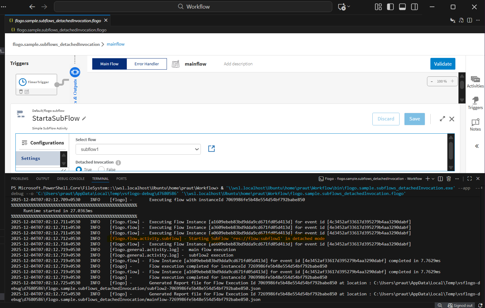

## Help
Please visit our [TIBCO Flogo® Extension for Visual Studio Code 1.3.5](https://docs.tibco.com/pub/flogo-vscode/latest/doc/html/Default.htm#flogo-vscode-user-guide/app-development/creating-flows-triggers/flows/attaching-a-flow-to-.htm) 
