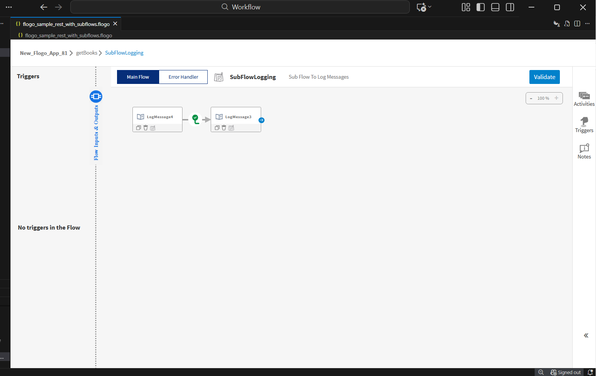
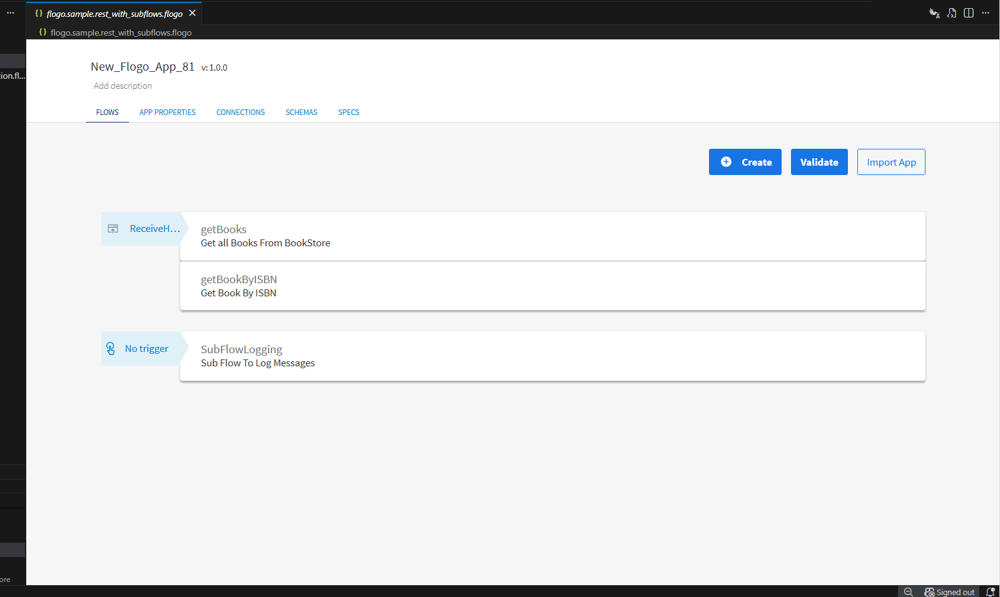
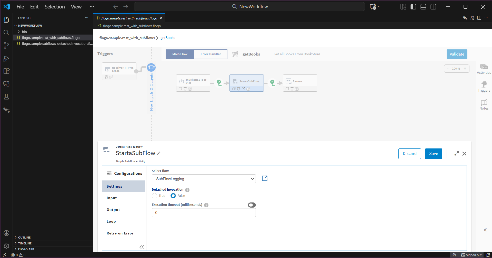

# Subflows Sample

## Understanding the configuration

The App have two flows & one subflow. Both flows contains a invokeRestService activity, Subflow Activity & return Activity with Rest trigger to get Book & gets Books By ISBN. But subflow subflowLogging without trigger. The REST trigger listens on port 9999. Based on incoming request path, it invokes either getBooks  or getBookByISBN flow.

* getBooks Flow : The flow calls a REST backend using an InvokeRESTService activity to fetch all books. Then it calls the subflow SubFlowLogging via a Start a SubFlow activity. Finally the flow returns the JSON result to the REST caller using a Return activity. 

* getBooksByISBN Flow : The flow invokes the backend via InvokeRESTService to get the book by ISBN. Based on response or input validation, the flow branches:

Success : If valid ISBN and book found - invokes SubFlowLogging to log the successful response JSON (utility.renderJSON($activity[InvokeRESTService1].responseBody,boolean.false())) - returns the book data as JSON to caller (utility.renderJSON($activity[InvokeRESTService1].responseBody,boolean.false())).

Success with Condition : If response body is empty (string.equals(string.tostring($activity[InvokeRESTService1].responseBody), "[]")) - invokes SubFlowLogging to log "***********No Book found with the given ISBN Number**********" message - returns "No Book found with the given ISBN Number" response.

Success with Condition : If invalid ISBN (string.regex("[^0-9]", $flow.isbn)) - invokes SubFlowLogging to log ("**********Invalid ISBN Number********") message triggers error or returns (Invalid ISBN Number) response.

The subflow call and branching logic are configured via the Start a SubFlow activity, and the branch conditions are defined in the flow links/expressions.
The subflow output would be available for activities that come after the subflow call — though in this case the subflow is used only for logging, not for data transformation.
Every flow ends with a Return activity to ensure correct termination and that a response is sent back to the REST trigger.

This sample application is based on the BookStore example. It uses a REST API at the backend that returns sample JSON data. The backend REST API is hosted at https://my-json-server.typicode.com/tibcosoftware/tci-flogo/Book

First you will need to upload Throw Error Extention from [github.com/TIBCOSoftware/flogo-contrib/activity/error](https://github.com/TIBCOSoftware/flogo-contrib/tree/master/activity/error)

When you run this sample locally using TIBCO Flogo® Enterprise, the workflow behaves as follows:

1. To Get all Books - You will need to hit the url - http://localhost:9999/books
2. To Get Book By ISBN - you will need to hit the url - http://localhost:9999/books/1451648537
3. If you want to test Error Handler, you can hit the above url with Invalid ISBN number like http://localhost:9999/books/999
4. You can check the sample JSON data for correct ISBN to be used while testing the samples - https://my-json-server.typicode.com/tibcosoftware/tci-flogo/Book

## Copy App 

1. Copy the flogo.sample.rest_with_subflows.flogo and flogo.sample.subflows_detachedInvocation.flogo apps into your workspace.

2. Click on flogo.sample.rest_with_subflows.flogo app. On the app-details page of flogo.sample.rest_with_subflows.flogo, you can see the getBooks, getBooksByISBN, and SubFlowLogging flows. Click the getBooks flow. You’ll see the REST trigger connected to an InvokeRestActivity; the InvokeRestActivity is connected to a StartSubFlowActivity; and the StartSubFlowActivity is connected to a Return Activity. Then click the StartSubFlowActivity — you will see a Configuration tab. Inside the Configuration tab, you will see Settings, Input, Output, Loop, and Retry on Error options displayed.

3. Subflow configuration. On opening the StartASubFlow activity, in the Settings tab, you can see the list of available subflows, the Open Subflow button, and an option to set detached invocation to true/false.

4. Opening a subflow. After selecting a subflow and saving it, clicking on the Open Subflow button appends the selected subflow to the right of the current flow.

5. Set Detached Invocation. Refer to app "flogo.sample.subflows_detachedInvocation.flogo"
Setting detached invocation to True, the subflow is invoked in fire-and-forget mode; in such a case, the main flow will not wait for the subflow to complete. Since the main flow is independent of the subflow output, the Output tab is hidden upon setting detached invocation. Detached invocation is set to False by default.

In this case, subflow1 is invoked in detached invocation True mode from the main flow. So, the main flow will not wait for completion of subflow1 and will execute the activities ahead. Since subflow1 is invoked in detached True mode, we will have 'Starting SubFlow 'res://flow:subflow1' in detached mode' printed in logs.

Upon encountering subflow1 in detached mode, the execution moves to completion of the main flow, and 'main flow execution' is printed followed by 'subflow2 execution' and 'subflow1 execution'.
The same can be understood by the timestamp difference in logs.

## Help

Please visit our [TIBCO Flogo&trade; Extension for Visual Studio Code documentation](https://docs.tibco.com/pub/flogo/latest/doc/html/Default.htm#flogo-all-vsc/creating-subflows.htm?TocPath=User%2520Guide%257CApp%2520Development%257CCreating%2520Flows%2520and%2520Triggers%257CFlows%257CUsing%2520Subflows%257C_____1) for additional information.

